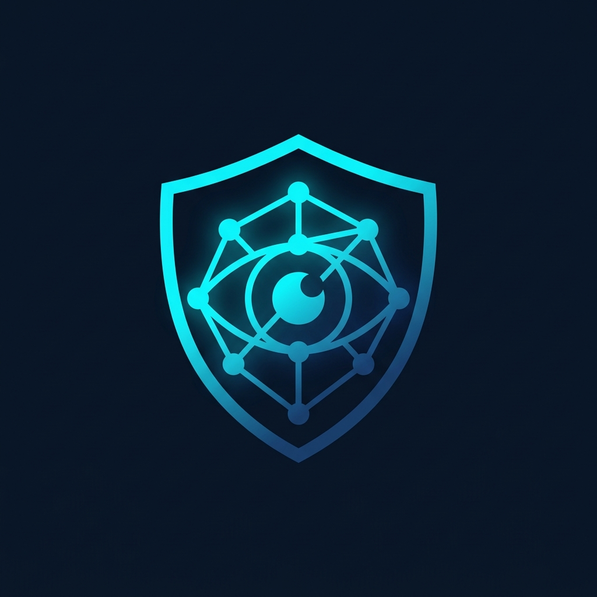

# 🛡️ SOCsentinel
<p align="center">
  
</p>

<p align="center">
  
</p>


<h3 align="center">Multi-Agent LLM Assistant for SOC Analysts</h3>

<p align="center">
  <em>Automating Level 1-3 SOC analyst workflows with 8 specialized AI agents powered by Qwen3 on AMD MI300X (ROCm).</em>
</p>

<p align="center">
  <a href="https://hackathon.amd.com"></a>
  
  
  
</p>

---

## 🎯 The Problem & Our Solution

Security Operation Centers face an unsustainable workload:

- **11,000** security alerts per day per SOC team
- **45 minutes** average triage time per alert
- **78%** analyst burnout rate
- **68%** of alerts go uninvestigated

**SOCsentinel** addresses this by deploying a fully autonomous, multi-agent LLM system that automates L1-L3 triage, evidence collection, MITRE ATT&CK mapping, report generation, and containment planning. We reduce triage time from **45 minutes to under 5 minutes**, empowering analysts to focus solely on high-level decision-making via our Human-in-the-Loop decision panel.

## 🏗️ Architecture

```
┌─────────────────────────────────────────────────────────┐
│                    React Dashboard                       │
│     (Real-time SSE, MITRE Heatmap, Dark Ops Theme)       │
├─────────────────────────────────────────────────────────┤
│                    FastAPI Backend                        │
│             /api/v1/* (Pydantic v2, LangChain)           │
├─────────────────────────────────────────────────────────┤
│               8-Agent Investigation Pipeline             │
│                                                         │
│  ┌────────────┐  ┌──────────┐  ┌──────────┐  ┌────────┐ │
│  │Orchestrator │→│L1 Triage │→│ Evidence │→│ MITRE  │ │
│  │ (Qwen3-7B)  │  │(Qwen3-4B)│  │(Qwen3-7B)│  │Mapper  │ │
│  └────────────┘  └──────────┘  └──────────┘  │(Qwen3-7B)│ │
│                                             └────┬─────┘ │
│                                                  ↓       │
│                                     ┌──────────────────┐ │
│                                     │ Threat Generator │ │
│                                     │  (optional)      │ │
│                                     └──────┬───────────┘ │
│                                            ↓             │
│  ┌──────────┐  ┌──────────┐  ┌────────────────┐  ┌─────┐│
│  │Detection │→│  Report  │→│ Response Planner │→│Validator││
│  │(Qwen3-7B)│  │(Qwen3-14B)│ │   (Qwen3-14B)  │ │(Qwen3-7B)││
│  └──────────┘  └──────────┘  └────────────────┘  └─────┘│
├─────────────────────────────────────────────────────────┤
│  ChromaDB (MITRE ATT&CK RAG)  │  vLLM (AMD MI300X)    │
└─────────────────────────────────────────────────────────┘
```

## 🤖 Agent Specializations

SOCsentinel deploys 8 specialized AI agents (plus an optional Threat Generator), each utilizing specific reasoning guardrails and Qwen3 models optimized for their workload:

| Agent                           | Model     | Role & Capability                                                                |
| ------------------------------- | --------- | -------------------------------------------------------------------------------- |
| **Orchestrator**                | Qwen3-7B  | Alert routing, priority assignment, and workflow coordination.                   |
| **L1 Triage**                   | Qwen3-4B  | False positive detection, severity scoring, and initial classification.          |
| **Evidence Collector**          | Qwen3-7B  | IOC enrichment, threat intel retrieval, and CVE correlation.                     |
| **MITRE Mapper**                | Qwen3-7B  | ATT&CK technique mapping, kill chain analysis grounded by a ChromaDB Vector RAG. |
| **Detection Agent**             | Qwen3-7B  | Sigma rule generation for SIEM detection coverage.                               |
| **Report Writer**               | Qwen3-14B | Comprehensive investigation reporting and executive summaries.                   |
| **Response Planner**            | Qwen3-14B | Automatic generation of prioritized, step-by-step L3 containment playbooks.      |
| **Validator**                   | Qwen3-7B  | Adversarial safety review with risk scoring and optional Sigma validation.       |
| **Threat Generator (Optional)** | Qwen3-7B  | Proactive attack scenario generation for hunting and purple team exercises.      |

## ✨ Key Features

- **Real-Time Agent Streaming (SSE)**: Watch the multi-agent pipeline execute live via Server-Sent Events with beautiful, animated UI state transitions.
- **MITRE ATT&CK Heatmap**: A live, dynamic matrix visualizing technique density across all processed investigations to identify broader threat patterns.
- **Qwen3 "Thinking Mode"**: A togglable feature that allows judges/analysts to peer inside the "brain" of the LLMs to see their Chain-of-Thought (CoT) reasoning logic directly in the audit trail.
- **Threat Intel RAG**: Vector-grounded intelligence utilizing ChromaDB to parse and map over 697 MITRE techniques in real-time.
- **Sigma Detection Rules**: Detection Agent outputs deployable Sigma YAML for SIEM platforms.
- **SOAR Export**: Push investigation results to Splunk SOAR, Cortex XSOAR, or Microsoft Sentinel formats.
- **Human-in-the-Loop (HITL)**: Enterprise-grade escalation engine where human analysts can approve, reject, or escalate the AI's proposed response playbooks.

## 🚀 Quick Start

### Prerequisites

- Python 3.11+
- Node.js 18+
- Git

### Backend Setup

```bash
cd backend
python -m venv .venv
.venv/Scripts/activate  # Windows
# source .venv/bin/activate  # Linux/Mac

pip install -r requirements.txt
cp .env.example .env  # Edit as needed (LLM_PROVIDER=mock for local dev)

# Ingest MITRE ATT&CK data (697 techniques)
python -m scripts.ingest_mitre

# Start server
uvicorn app.main:app --reload --port 8000
```

### Frontend Setup

```bash
cd frontend
npm install
npm run dev
```

### Run Tests

The platform includes a robust testing suite (100% pass rate).

```bash
cd backend
pytest tests/ -v
```

## 📡 API Endpoints

| Method | Endpoint                              | Description                        |
| ------ | ------------------------------------- | ---------------------------------- |
| `GET`  | `/health`                             | Health check                       |
| `POST` | `/api/v1/alerts/generate`             | Generate synthetic alert           |
| `POST` | `/api/v1/pipeline/investigate`        | Run full 8-agent investigation     |
| `POST` | `/api/v1/pipeline/investigate-demo`   | Demo with synthetic alert          |
| `GET`  | `/api/v1/pipeline/stream-investigate` | SSE real-time pipeline stream      |
| `GET`  | `/api/v1/pipeline/list`               | List all investigations            |
| `GET`  | `/api/v1/pipeline/status/{id}`        | Get investigation status           |
| `GET`  | `/api/v1/pipeline/stats`              | Dashboard aggregate metrics        |
| `GET`  | `/api/v1/pipeline/mitre-heatmap`      | Aggregated MITRE technique density |
| `POST` | `/api/v1/pipeline/decision/{id}`      | Human-in-Loop decision             |
| `POST` | `/api/v1/pipeline/thinking-mode`      | Toggle Qwen3 CoT reasoning         |
| `POST` | `/api/v1/detection/generate`          | Generate Sigma detection rule      |
| `POST` | `/api/v1/response-planner/generate`   | Generate response playbook         |
| `POST` | `/api/v1/validator/validate`          | Validate response playbook         |
| `POST` | `/api/v1/threat-generator/generate`   | Generate threat scenario           |
| `POST` | `/api/v1/threat-intel/fetch`          | Fetch TAXII/STIX intel             |
| `POST` | `/api/v1/soar/export`                 | Export investigation to SOAR       |

_Interactive API docs available at `http://localhost:8000/docs`._

## 🛡️ Security Features

- **Prompt Injection Detection** — Blocks common injection patterns.
- **PII Redaction** — Auto-redacts SSN, credit cards, emails from LLM output.
- **Input Length Limits** — Prevents token abuse.
- **CORS Middleware** — Configured frontend origin.

## 🧪 Testing

```
58 tests passed
├── test_alerts.py       — 5 tests (synthetic generator)
├── test_api.py          — 6 tests (API integration)
├── test_escalation.py   — 10 tests (L1/L2/L3 escalation rules)
├── test_guardrails.py   — 10 tests (security guardrails)
├── test_llm_client.py   — 8 tests (mock LLM)
├── test_pipeline.py     — 5 tests (E2E pipeline + escalation)
└── test_siem.py         — 14 tests (Wazuh connector)
```

## 🔧 Tech Stack

| Layer        | Technology                                        |
| ------------ | ------------------------------------------------- |
| **LLM**      | Qwen3 (4B/7B/14B) via vLLM on AMD MI300X          |
| **Backend**  | FastAPI, Pydantic v2, LangChain                   |
| **Frontend** | React 18, TypeScript, Vite, TailwindCSS           |
| **RAG**      | ChromaDB + MITRE ATT&CK Enterprise Matrix         |
| **SIEM**     | Wazuh (webhook integration) + Synthetic generator |
| **Infra**    | AMD ROCm, Docker, Hugging Face Spaces             |

## 🏆 Hackathon Targets

- **Grand Prize** — End-to-end multi-agent SOC platform.
- **Track 1: AI Agents** — 8 specialized, coordinated agents utilizing RAG and HITL workflows.
- **Hugging Face Special Prize** — Prepared for HF Spaces deployment.
- **Build in Public** — Open development process.

## 📝 License

MIT

---

_Built with ❤️ for the [AMD Developer Hackathon 2026](https://hackathon.amd.com)_
